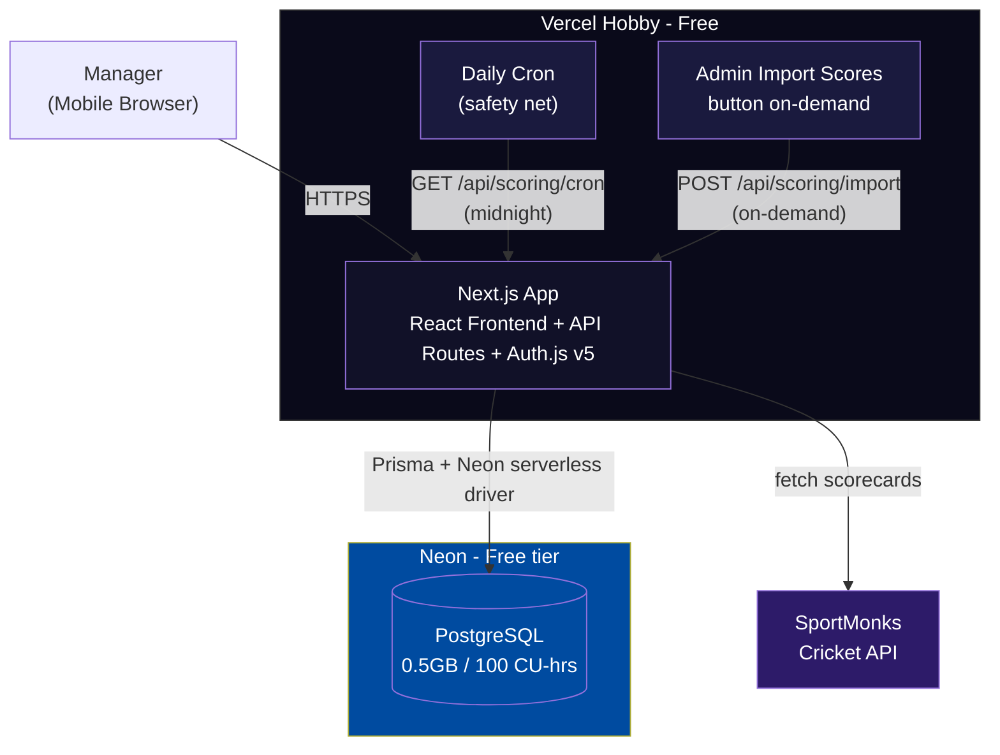
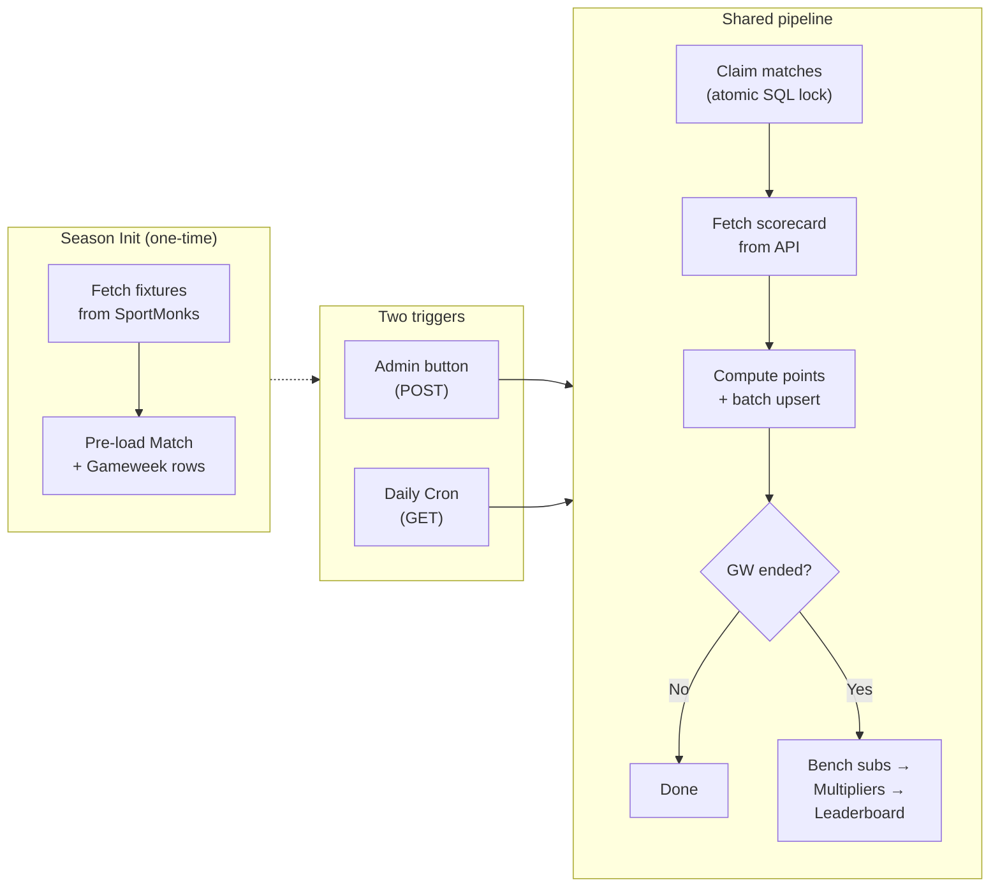

# FAL — High-Level Architecture

## 1. Overview

FAL is a fantasy cricket platform for IPL. Phase 1 is a monolithic Next.js app on Vercel (free tier) with Neon PostgreSQL and SportMonks as the cricket data provider.

### Tech Stack
| Layer | Technology |
|---|---|
| Frontend | Next.js 14+ App Router, React, TypeScript, Tailwind CSS |
| Backend | Next.js API Routes (serverless) |
| Database | Neon PostgreSQL (free tier) + Prisma ORM (`@prisma/adapter-neon`) |
| Auth | Auth.js v5 (OAuth + credentials) |
| Cricket Data | SportMonks API (€29/mo) |
| Deployment | Vercel Hobby (free) |
| Cron | Vercel Cron (1 daily job) + admin-triggered scoring |

### Platform Constraints
- **Vercel Hobby:** 1 cron job, 60s function limit, 4.5MB response body, non-commercial
- **Neon free tier:** 0.5GB storage, 100 compute-hrs/mo, auto-suspends after 5 min (~1-3s cold start)
- **SportMonks:** 3,000 calls/hr (FAL needs ~5 per match day)

## 2. System Architecture



## 3. Scoring Pipeline (high-level)



**Key design decisions:**
- Raw SQL (`$queryRaw`) for atomic match/GW claims — Prisma ORM doesn't support `UPDATE...RETURNING`
- Batch `INSERT...ON CONFLICT` for player performance (1 SQL statement for ~30 players, not N+1 upserts)
- Error recovery: 3 retries per match, `error` state, stuck detection on cron
- GW aggregation has its own atomic lock to prevent double-header race conditions
- Up to 4 matches per invocation (~25-35s, within 60s budget)

## 4. Core Services

All services run as modules in `lib/`:

| Service | Location | Responsibility |
|---|---|---|
| Match Import | `lib/sportmonks/` | Fetch scorecards from SportMonks API |
| Stat Parser | `lib/scoring/batting.ts`, `bowling.ts`, `fielding.ts` | Extract + compute player stats |
| Fantasy Points Engine | `lib/scoring/pipeline.ts` | Apply scoring rules, calculate base points |
| Gameweek Aggregator | `lib/scoring/multipliers.ts` | Bench subs, C/VC, chips, team totals |
| Leaderboard | API routes | Rankings, season totals, history |
| Lineup Validation | `lib/lineup/` | Squad rules, lock timing, role constraints |

## 5. Data Model (summary)

11 entities — see [Implementation Plan](2026-03-22-fal-implementation-plan.md) for full field definitions, indexes, and constraints.

```
User → Team → TeamPlayer → Player
League → Team
Team → Lineup → LineupSlot
Gameweek → Match → PlayerPerformance → Player
Team → ChipUsage
PlayerScore (per player per GW, aggregated)
```

Key design choices:
- `Team.totalPoints` — incremental counter, avoids full re-aggregation for leaderboard
- `Match.scoringStatus` — state machine (`scheduled → completed → scoring → scored → error`)
- `Gameweek.aggregationStatus` — atomic lock for GW-end processing
- `PlayerPerformance.fantasyPoints` — per-match base points stored alongside raw stats
- `PlayerPerformance.inStartingXI` / `isImpactPlayer` — derived from lineup include

## 6. API Surface (summary)

~25 endpoints across 8 groups — see [Implementation Plan](2026-03-22-fal-implementation-plan.md) for full route definitions.

| Group | Key Routes | Auth |
|---|---|---|
| Auth | `[...nextauth]` | Public |
| Leagues | CRUD, join, settings | Member / League admin |
| Teams | Detail, squad, roster CSV upload | Owner / League admin |
| Lineups | Get/set XI, captain, chips | Owner |
| Scoring | Import, cron, recalculate, cancel, force-end-gw, status | Platform admin |
| Leaderboard | Standings, history | Member |
| Players | Search/filter, detail | Authenticated |
| Gameweeks | Current, list | Authenticated |

Two admin levels: **platform admin** (`User.role === 'ADMIN'`) for scoring/season ops, **league admin** (`league.adminUserId`) for league management.

## 7. Hosting & Cost

| Service | Cost |
|---|---|
| Vercel Hobby | $0 |
| Neon PostgreSQL | $0 |
| SportMonks Major | ~$31/mo |
| **Total (IPL season)** | **~$31/mo** |
| **Annual** | **~$62-74/yr** |

## 8. Future Architecture (Phase 2+)

- **Auction Engine:** Real-time WebSocket bidding, $100M budget, 10s timer
- **Mid-Season Auction:** After 30 matches, sell back at 90% market value
- **Market System:** Dynamic pricing, price history graphs
- **Engagement:** Power rankings, analytics, AI lineup suggestions

## Related Documents
- [Design Spec](2026-03-15-fal-design.md) — Scoring rules, chips, lineup mechanics, UI designs
- [API Exploration](2026-03-22-sportmonks-api-exploration.md) — SportMonks field validation, gap analysis
- [Implementation Plan](2026-03-22-fal-implementation-plan.md) — Database schema, API routes, scoring pipeline, local setup, deployment
