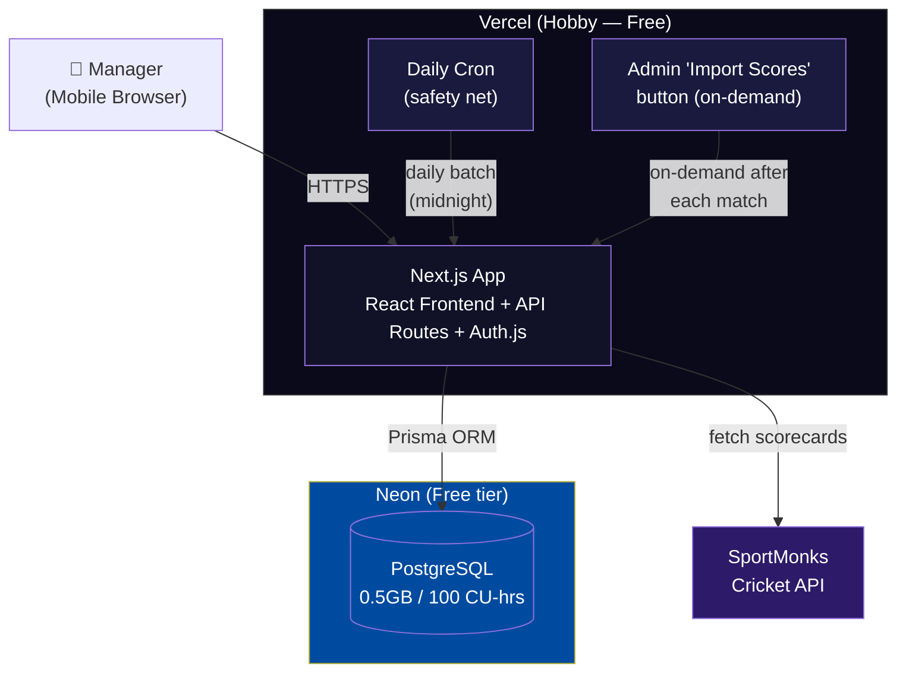
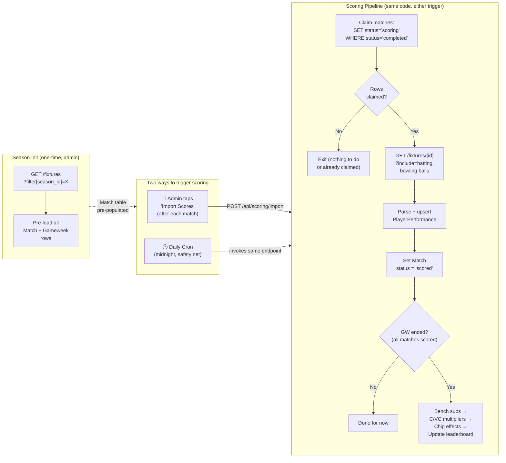

# FAL — Technical Architecture

## 1. Architecture Overview (Phase 1)

### Monolithic Next.js:
- Single Next.js app on Vercel
- API routes for backend logic
- React frontend (mobile-first)
- PostgreSQL (Vercel Postgres or Neon) + Prisma ORM
- Auth.js for authentication (OAuth + credentials)
- Vercel Cron for match data polling

### Tech Stack:
| Layer | Technology |
|---|---|
| Frontend | Next.js + React + TypeScript |
| Styling | Tailwind CSS |
| Backend | Next.js API Routes |
| Database | Neon PostgreSQL (free tier — 0.5GB, 100 compute-hrs/mo) |
| ORM | Prisma |
| Auth | Auth.js (OAuth + credentials) |
| Deployment | Vercel (Hobby — free) |
| Cron | Vercel Cron (daily) + admin-triggered API routes |

### Platform Constraints:
- **Vercel Hobby plan:** Cron jobs limited to once per day, function duration max 60s, non-commercial use only. Sufficient for FAL with hybrid scoring approach (daily cron + admin-triggered imports).
- **Neon free tier:** 0.5GB storage, 100 compute-hrs/mo, 10K pooled connections. Sufficient for Phase 1 (~15 managers, 74 matches). Auto-suspends after 5 min idle.

### System Architecture



**Everything runs free** — Vercel Hobby (frontend, API, daily cron) + Neon free tier (PostgreSQL). Admin triggers score imports on-demand after each match via a button in the admin panel. Daily cron at midnight catches anything missed.

### Scoring Pipeline Flow



## 2. Core Services

All services run within the Next.js monolith as modules:

1. **Match Import Service** — Polls cricket API, stores raw match data
2. **Stat Parser** — Extracts player performance stats from raw data
3. **Fantasy Points Engine** — Applies scoring rules, calculates base points
4. **Gameweek Aggregator** — Bench subs, multipliers, chips, team totals
5. **Leaderboard Service** — Rankings, season totals, history
6. **Lineup Validation Service** — Enforces squad size, player uniqueness within league, lineup lock timing

### Service Flow:
See System Architecture and Scoring Pipeline Flow diagrams in Section 1.

## 3. Database Entities

- **User** — Platform user (auth)
- **League** — Fantasy competition container. Stores `adminUserId` (creator/admin), `inviteCode`, settings.
- **Team** — Manager's team within a league
- **TeamPlayer** — Join table: which Player belongs to which Team (enforces uniqueness within a league)
- **Player** — Real IPL player (from API). Stores name, IPL team, role (BAT/BOWL/ALL/WK).
- **Gameweek** — Global weekly scoring period (Mon–Sun). Shared across all leagues, not league-specific.
- **Match** — An IPL match within a gameweek. Stores teams, date, status (scheduled/in_progress/completed), API match ID.
- **Lineup** — Weekly lineup submission per team per gameweek
- **LineupSlot** — Individual slot within a lineup. Stores: `playerId`, `slotType` (XI/BENCH), `benchPriority` (1-4, null for XI), `role` (CAPTAIN/VC/null).
- **PlayerPerformance** — Raw match statistics per player per match
- **PlayerScore** — Calculated fantasy points per player per gameweek (aggregated across matches)
- **ChipUsage** — Which chip a team used in which gameweek

### Entity Relationships:
See entity descriptions above for fields. Key relationships: User 1→N Team, League 1→N Team, Team 1→N TeamPlayer, Player 1→N TeamPlayer, Team 1→N Lineup, Lineup 1→N LineupSlot, Gameweek 1→N Match, Match 1→N PlayerPerformance.

### Uniqueness Constraints:
- `TeamPlayer`: unique(`leagueId`, `playerId`) — a player can only be on one team per league
- `Lineup`: unique(`teamId`, `gameweekId`) — one lineup per team per gameweek
- `ChipUsage`: unique(`teamId`, `chipType`) — each chip used once per season
- `LineupSlot`: unique(`lineupId`, `playerId`) — a player appears once per lineup

## 4. Cricket Data API Evaluation

> Scoring rules and pipeline details are defined in the [Design Spec](2026-03-15-fal-design.md) Sections 6, 9, and 11. This section covers implementation-specific concerns only.

### Provider Landscape

No cricket API provides scorecard-level data (batting, bowling, fielding stats) for free. All providers require a paid plan for the data FAL needs.

### API Comparison

| | SportMonks | CricketData.org | Roanuz | EntitySport |
|---|---|---|---|---|
| **Base URL** | `cricket.sportmonks.com/api/v2.0/` | `api.cricapi.com/v1/` | `sports.roanuz.com/` | `rest.entitysport.com/v2/` |
| **Auth** | API token (query param) | API key (query param) | API key | API key |
| **Pricing** | **€29/mo** (Major, 26 leagues) | Paid (price unlisted, contact required) | **~$240/season** | **$250/mo** (Pro) or **$450/mo** (Elite for fantasy) |
| **Free tier** | 14-day trial only | 500 req/day (match lists only, no scorecards) | Unknown | None |
| **IPL coverage** | Yes (confirmed IPL 2026) | Yes | Yes (IPL 2026, 70+ matches) | Yes |
| **Scorecard** | `GET /fixtures/{id}?include=batting,bowling` | `v1/match_scorecard?id={matchId}` | Yes | Yes |
| **Composable includes** | Yes (`batting`, `bowling`, `lineup`, `runs`, `balls`, `venue`, `toss`) | No (fixed response) | Yes | Yes |
| **Ball-by-ball** | Yes (`?include=balls`) — production ready | "Testing" — not production ready | Yes (detailed: fielder, thrower, ball speed) | Yes |
| **Built-in fantasy pts** | No (calculate ourselves) | Yes (`v1/match_points`) | Yes (fantasy API) | Yes (Elite plan only, $450/mo) |
| **Rate limit** | 3,000 calls/hr per entity | 500 req/day (free) | Unknown | 500K–2M calls/mo |
| **Fielding data** | Partial (needs ball-by-ball computation) | Yes (dedicated catching array) | Yes (per-ball fielder data) | Yes |
| **Dot balls** | Compute from ball-by-ball | Not available | Compute from ball-by-ball | Unknown |

### Batting Scorecard Fields

| FAL Stat Needed | CricketData Field | SportMonks Field |
|---|---|---|
| Runs scored | `r` | `score` |
| Balls faced | `b` | `ball` |
| Fours hit | `4s` | `four_x` |
| Sixes hit | `6s` | `six_x` |
| Strike rate | `sr` | `rate` |
| Dismissal type | `dismissal` | `dismissal` |
| Did player bat? | Present in batting array = yes | Present in batting array = yes |

### Bowling Scorecard Fields

| FAL Stat Needed | CricketData Field | SportMonks Field |
|---|---|---|
| Overs bowled | `o` | `overs` |
| Maidens | `m` | `medians` |
| Runs conceded | `r` | `runs` |
| Wickets taken | `w` | `wickets` |
| Economy rate | `eco` | `rate` |
| No balls | `nb` | — |
| Wides | `wd` | — |
| **Dot balls** | **Not available** | **Not available** |

### Fielding Scorecard Fields

| FAL Stat Needed | CricketData Field | SportMonks Field |
|---|---|---|
| Catches | `catch` (in catching array) | — (not in standard includes) |
| Stumpings | `stumped` | — |
| Runouts | `runout` | — |

### Critical Finding: Dot Ball Gap

**Neither API provides a dot ball count in the bowling scorecard.** Options:

1. **Compute from ball-by-ball data** — SportMonks provides this via `?include=balls` (each ball has `score`, `wicket`, `six`, `four`). Count balls where `score=0` and not a wide/no-ball. CricketData's ball-by-ball is still in testing.
2. **Compute from summary stats** — `dots = balls_bowled - (runs from bat / SR * balls)` — unreliable due to extras.
3. **Drop dot ball scoring** — This aligns with industry (neither Dream11 nor IPL Official awards dot ball points). See Design Spec Issue #2.

**Recommendation:** Use SportMonks with ball-by-ball if dot balls are kept. If dot balls are dropped (per Issue #2), either API works without ball-by-ball data.

### Recommendation: SportMonks (€29/mo Major Plan)

| Factor | SportMonks | Runner-up |
|---|---|---|
| **Cost** | €29/mo (~$31/mo) | Roanuz ~$240/season (~$30/mo amortized) |
| **Single request = full scorecard** | Yes (composable includes) | CricketData: No (fixed response) |
| **Ball-by-ball production ready** | Yes | CricketData: "Testing" status |
| **IPL 2026 confirmed** | Yes (blog post + demo) | Roanuz: Yes |
| **Rate limit headroom** | 3,000/hr (FAL needs ~5/day) | More than enough on any plan |
| **Fielding data gap** | Catches/stumpings/runouts need ball-by-ball computation | CricketData has dedicated catching array |

**Why SportMonks wins:**
1. **Cheapest option** at €29/mo — EntitySport is 8x more ($250/mo), Roanuz is comparable but less documented
2. **One API call gets everything** — `GET /fixtures/{id}?include=batting,bowling,lineup,runs,balls` returns the full scorecard + ball-by-ball in a single request
3. **Ball-by-ball is production-ready** — critical if we keep dot ball scoring (Design Spec Issue #2)
4. **IPL 2026 explicitly supported** — confirmed in their blog with working demos
5. **3,000 calls/hour** — FAL needs ~5 requests per match day, so massive headroom for retries and re-imports

**Trade-offs accepted:**
- No built-in fantasy points (we calculate our own — this is actually better since FAL has custom scoring rules)
- Fielding stats (catches, stumpings, runouts) not in standard batting/bowling includes — must extract from ball-by-ball data or scorecard text. This is solvable but adds parsing complexity.
- Off-season cost: €29/mo even when IPL isn't running. Cancel and resubscribe seasonally to save ~€200/year.

**Fallback:** Admin manual stat entry via CSV upload if API is unavailable for a match. Design spec already supports this.

## 5. Data Ingestion Pipeline

### Requests Per Match (SportMonks)

| Step | Endpoint | Requests |
|---|---|---|
| Poll for completed matches | `GET /fixtures?filter[status]=Finished&filter[season_id]=X` | 1 (shared) |
| Fetch full scorecard + ball-by-ball | `GET /fixtures/{id}?include=batting,bowling,lineup,runs,balls` | 1 per match |

**Double-header day total:** 1 poll + 2 combined scorecard requests = **3 requests** (well within 3,000/hr rate limit).

### Season Initialization (one-time)

At the start of the IPL season, admin triggers a one-time fixture import:
```
1. GET /fixtures?filter[season_id]=X → fetch all ~74 IPL matches
2. Create Match rows with date, homeTeam, awayTeam, apiMatchId
3. Auto-generate Gameweek rows (Mon-Sun windows covering the season)
4. Assign each Match to its Gameweek based on match date
```
This pre-populates the Match table so cron jobs can check locally whether matches are scheduled today — **zero API calls on non-match days.**

### Hybrid Scoring Strategy (Hobby-compatible)

Vercel Hobby limits cron to once per day. Instead of paying for Pro ($20/mo), we use a hybrid approach:

**Primary: Admin-triggered import (on-demand)**
After each IPL match ends, admin taps "Import Scores" in the admin panel → `POST /api/scoring/import`. This runs the full pipeline (import + score + leaderboard) as a single API route handler within Hobby's 60s function limit.

**Safety net: Daily cron (midnight)**
```
# Runs once daily at midnight UTC — catches any matches admin missed
0 0 * * *
```
Same pipeline code, just triggered by cron instead of admin button.

### Scoring Pipeline (single unified flow)

Both triggers invoke the same pipeline:
```
1. Claim unscored matches using optimistic lock:
   UPDATE Match SET scoringStatus = 'scoring'
   WHERE scoringStatus = 'completed' RETURNING id
   → No rows returned → exit (another process claimed them, or nothing to score)
2. For each claimed match:
   a. GET /fixtures/{id}?include=batting,bowling,lineup,runs,balls
   b. Parse response → compute dot balls, fielding stats from ball-by-ball in memory
   c. Upsert PlayerPerformance rows (keyed on playerId + matchId)
   d. Set Match.scoringStatus = 'scored'
3. If gameweek has ended (all matches in GW are 'scored'):
   a. Aggregate player points across matches in the gameweek
   b. Apply bench auto-substitutions
   c. Apply captain/VC multipliers
   d. Apply chip effects (multiplicative with captain)
   e. Update leaderboard
```
Steps 2a-2d run in a database transaction per match. Step 3 only runs at gameweek end.

**Concurrency guard:** The `SET scoringStatus = 'scoring' WHERE scoringStatus = 'completed'` is an atomic claim — if admin and cron fire simultaneously, only one gets rows back. The other exits cleanly.

**Idempotency:** All writes use upserts keyed on `(playerId, matchId)`. Re-running the pipeline for the same match overwrites, not duplicates.

**Batch limit:** Pipeline processes at most 2 matches per invocation. If the midnight cron catches 3+ missed matches, it scores 2 and leaves the rest for the next daily run or manual trigger.

Estimated time: ~5-10s per match (well within 60s Hobby limit with 2-match batch cap).

### Match.scoringStatus State Machine
```
scheduled → completed → scoring → scored
                ↑                    |
                └── (re-score) ──────┘
```
`scheduled` = fixture pre-loaded, `completed` = match finished, `scoring` = claimed by pipeline (concurrency lock), `scored` = fantasy points written. Re-score resets to `completed` for reprocessing.

### Admin Controls
- **Import & Score:** `POST /api/scoring/import` — admin taps after each match to import stats and calculate scores (primary trigger)
- **Re-import:** `POST /api/scoring/recalculate/[matchId]` — re-fetch stats and recalculate a specific match (if API data was corrected)
- Both run as API route handlers within Hobby's 60s function limit

## 6. API Routes (Phase 1)

All routes require authentication via Auth.js session unless noted. Routes marked **(admin)** require the calling user to be the league admin (`league.adminUserId === session.userId`) or platform admin. Routes marked **(owner)** require the calling user to own the team (`team.userId === session.userId`).

**Error responses** (standard across all routes):
- `401` — Not authenticated (no valid session)
- `403` — Forbidden (not admin/owner for this resource)
- `404` — Resource not found
- `409` — Conflict (e.g., chip already used this season, player already on another team)
- `422` — Validation failure (e.g., invalid lineup, lock in effect)
- `423` — Locked (lineup lock in effect, no edits allowed)

### Auth:
- `POST /api/auth/[...nextauth]` — Auth.js handler (public)

### Leagues:
- `POST /api/leagues` — Create league (caller becomes admin)
- `GET /api/leagues` — List leagues the current user belongs to
- `GET /api/leagues/[id]` — League detail: settings, invite code, manager list **(member)**
- `GET /api/leagues/[id]/teams` — List all teams in the league with manager names **(member)**
- `POST /api/leagues/[id]/join` — Join via invite code (returns 409 if league full)
- `PUT /api/leagues/[id]/settings` — Update league settings **(admin)**
- `DELETE /api/leagues/[id]/managers/[userId]` — Remove a manager and their team **(admin)**

### Teams:
- `GET /api/teams/[teamId]` — Team detail: name, manager, squad size **(owner or league member)**
- `GET /api/teams/[teamId]/squad` — List players on this team **(owner or league member)**
- `POST /api/leagues/[id]/roster` — Upload roster CSV for all teams **(admin)**

### Lineups:
- `GET /api/teams/[teamId]/lineups/[gameweekId]` — Get lineup (playing XI, bench order, captain, VC, chip) **(owner)**
- `PUT /api/teams/[teamId]/lineups/[gameweekId]` — Submit/update lineup (upsert). Returns 423 if locked **(owner)**
- `POST /api/teams/[teamId]/lineups/[gameweekId]/chip` — Activate chip. Returns 409 if already used this season, 423 if locked **(owner)**
- `DELETE /api/teams/[teamId]/lineups/[gameweekId]/chip` — Deactivate chip before lock **(owner)**

### Scoring:
- `GET /api/leagues/[leagueId]/scores/[gameweekId]` — Gameweek scores for all teams in a league **(member)**
- `GET /api/teams/[teamId]/scores/[gameweekId]` — Detailed score breakdown for a single team (per-player points, subs, multipliers) **(owner or league member)**
- `POST /api/scoring/import` — Trigger match import + scoring pipeline **(admin)**
- `POST /api/scoring/recalculate/[matchId]` — Reset match to `completed` and re-score **(admin)**
- `GET /api/scoring/status` — List matches with their `scoringStatus` (scheduled/completed/scoring/scored) **(admin)**

### Season Admin:
- `POST /api/admin/season/init` — Import IPL fixture list from SportMonks, create Match + Gameweek rows **(admin, one-time per season)**

### Leaderboard:
- `GET /api/leaderboard/[leagueId]` — Current league standings (total points, rank, GW points) **(member)**
- `GET /api/leaderboard/[leagueId]/history` — Gameweek-by-gameweek points per team **(member)**

### Players:
- `GET /api/players?role=BAT&team=MI&page=1&limit=25` — Search/filter players with pagination **(authenticated)**
- `GET /api/players/[id]` — Player detail: name, role, IPL team, current season stats **(authenticated)**

### Gameweeks:
- `GET /api/gameweeks/current` — Current gameweek info (number, lock time, matches, status) **(authenticated)**
- `GET /api/gameweeks` — List all gameweeks with status and match counts **(authenticated)**

## 7. Hosting & Cost Breakdown

### Vercel Hobby Plan Fit

| Requirement | FAL Needs | Hobby (Free) | Fits? |
|---|---|---|---|
| **Cron frequency** | Daily safety net | Once per day | Yes |
| **On-demand scoring** | Admin triggers after each match | API routes (60s limit) | Yes |
| **Function duration** | 15-30s (scoring pipeline) | Max 60s | Yes |
| **Bandwidth** | ~15 managers, low traffic | 100 GB/mo | Yes |
| **Commercial use** | Private league with friends | Non-commercial only | OK (personal/friends use) |

**Hobby works** with the hybrid approach — admin-triggered scoring replaces the need for frequent cron jobs.

### Monthly Cost Estimate (IPL Season — ~2 months)

| Service | Plan | Cost | Notes |
|---|---|---|---|
| **Vercel** | Hobby | **$0** | Free — frontend, API routes, daily cron, `.vercel.app` domain |
| **Neon Postgres** | Free tier | **$0** | 0.5GB storage, 100 compute-hrs/mo, 10K pooled connections |
| **SportMonks** | Major plan | **€29/mo (~$31)** | 26 cricket leagues, 3,000 calls/hr, 14-day free trial |
| **Auth.js** | Open source | **$0** | Self-hosted, no per-user costs |
| **Domain** | Optional | ~$12/yr | Custom domain (Vercel provides free `.vercel.app` subdomain) |
| | | **~$31/mo** | **Total during IPL season** |

### Annual Cost Estimate

| Period | Duration | Monthly Cost | Total |
|---|---|---|---|
| **IPL season** | ~2 months (Mar-May) | $31/mo (SportMonks only) | $62 |
| **Off-season** | 10 months | $0 (cancel SportMonks) | $0 |
| **Domain (optional)** | 12 months | — | $12 |
| | | **Annual total** | **~$62-74/yr** |

### Neon Free Tier Fit Analysis

| Resource | Neon Free Provides | FAL Phase 1 Needs | Fits? |
|---|---|---|---|
| Storage | 0.5 GB | ~74 matches × ~30 players × ~50 bytes ≈ <1 MB match data + players, leagues, lineups | Yes |
| Compute hours | 100 CU-hrs/mo | Daily cron + admin triggers + user API calls (~15 managers) | Yes |
| Connections | 10,000 pooled (pgBouncer) | Serverless function connections (~10 concurrent) | Yes |
| Idle timeout | 5 min auto-suspend | First request after idle has ~1s cold start | OK |

**Neon free tier is sufficient for Phase 1.** Ball-by-ball storage for all 74 matches ≈ 2.2MB — well within 0.5GB.

### Cost Scaling (Phase 2+)

| Trigger | Action | Added Cost |
|---|---|---|
| Need frequent auto-scoring | Vercel Pro (minute-level cron) | $20/mo |
| >0.5GB DB storage | Neon Launch plan | $19/mo |
| Multiple admins/devs | Vercel Pro seats | $20/seat/mo |
| WebSocket auction engine | Vercel or external WS hosting | TBD |
| Heavy traffic (public leagues) | Vercel Pro + bandwidth | $20/mo + $0.06/GB over 1TB |

## 8. Future Architecture (Phase 2+)

### Auction Engine:
- Real-time bidding with WebSockets
- $100M manager budget, $1M starting price, $0.5M bid increment
- 10-second timer (reset on each bid)
- Bid validation: remaining budget must allow filling remaining roster at $1M each
- Anti-sniping, auto-bid, reconnect handling

### Mid-Season Auction:
- After 30 IPL matches
- Managers can sell players back (90% market value) and bid for replacements

### Market System:
- Dynamic player pricing based on performance
- Price history graphs

### Engagement Features:
- Power rankings, player analytics
- Trade analyzer, AI lineup suggestions
