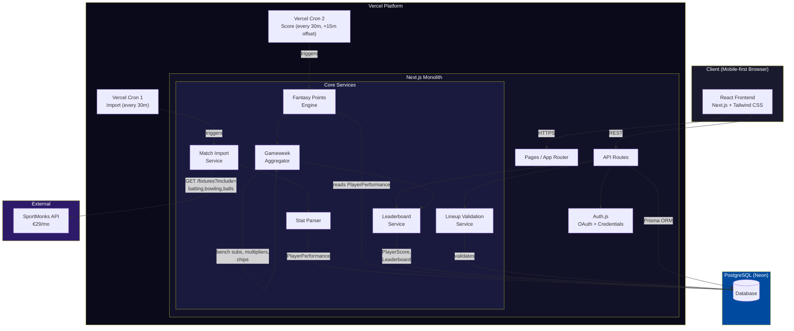
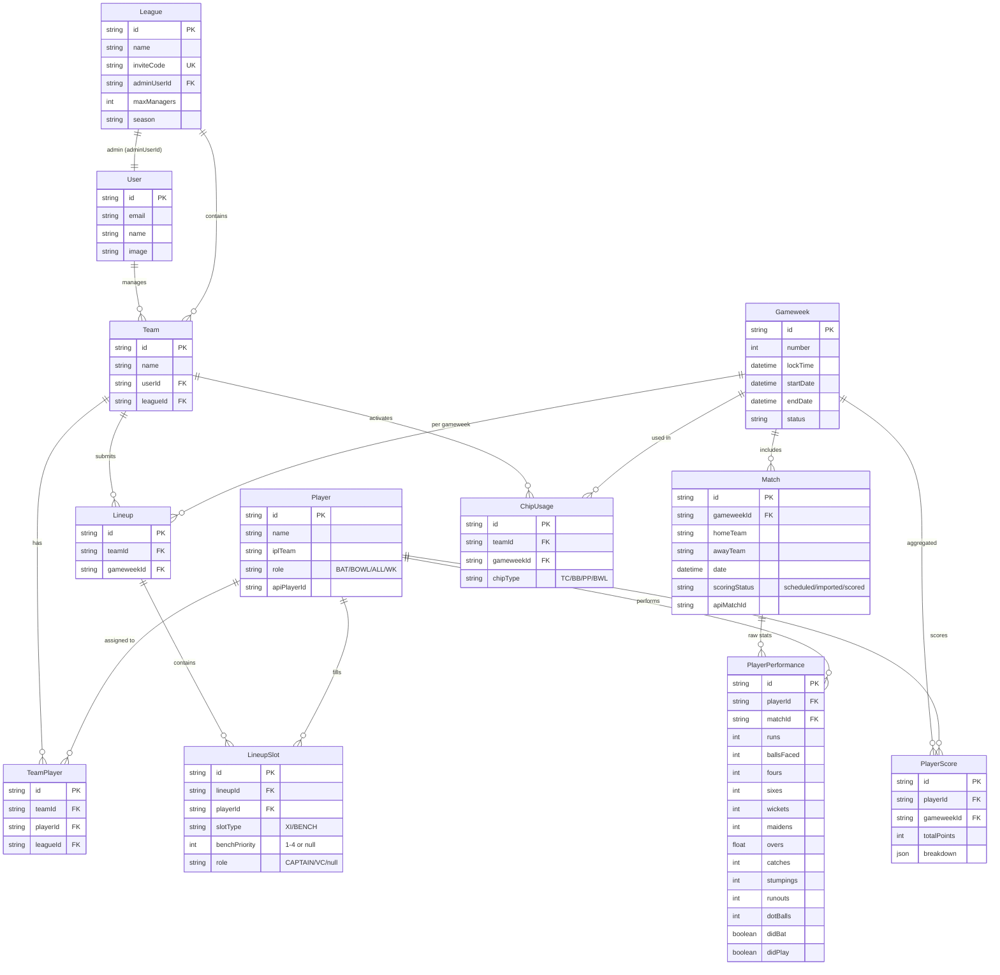
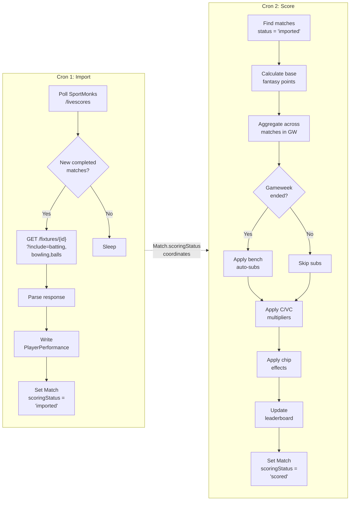

# FAL — Technical Architecture

## 1. Architecture Overview (Phase 1)

### Monolithic Next.js:
- Single Next.js app on Vercel
- API routes for backend logic
- React frontend (mobile-first)
- PostgreSQL (Vercel Postgres or Neon) + Prisma ORM
- Auth.js for authentication (OAuth + credentials)
- Vercel Cron for match data polling

### Tech Stack:
| Layer | Technology |
|---|---|
| Frontend | Next.js + React + TypeScript |
| Styling | Tailwind CSS |
| Backend | Next.js API Routes |
| Database | PostgreSQL (Vercel Postgres or Neon) |
| ORM | Prisma |
| Auth | Auth.js (OAuth + credentials) |
| Deployment | Vercel |
| Cron | Vercel Cron Jobs |

### Platform Constraints:
- **Vercel Cron execution limit:** 60s on Hobby, 300s on Pro. Scoring pipeline must complete within this window or be chunked into separate invocations.
- **Vercel Postgres connections:** Limited compute hours on Hobby. Use connection pooling (Prisma Data Proxy or PgBouncer via Neon).

### System Architecture



### Entity Relationship Diagram



### Scoring Pipeline Flow



## 2. Core Services

All services run within the Next.js monolith as modules:

1. **Match Import Service** — Polls cricket API, stores raw match data
2. **Stat Parser** — Extracts player performance stats from raw data
3. **Fantasy Points Engine** — Applies scoring rules, calculates base points
4. **Gameweek Aggregator** — Bench subs, multipliers, chips, team totals
5. **Leaderboard Service** — Rankings, season totals, history
6. **Lineup Validation Service** — Enforces squad size, player uniqueness within league, lineup lock timing

### Service Flow:
See System Architecture and Scoring Pipeline Flow diagrams in Section 1.

## 3. Database Entities

- **User** — Platform user (auth)
- **League** — Fantasy competition container. Stores `adminUserId` (creator/admin), `inviteCode`, settings.
- **Team** — Manager's team within a league
- **TeamPlayer** — Join table: which Player belongs to which Team (enforces uniqueness within a league)
- **Player** — Real IPL player (from API). Stores name, IPL team, role (BAT/BOWL/ALL/WK).
- **Gameweek** — Global weekly scoring period (Mon–Sun). Shared across all leagues, not league-specific.
- **Match** — An IPL match within a gameweek. Stores teams, date, status (scheduled/in_progress/completed), API match ID.
- **Lineup** — Weekly lineup submission per team per gameweek
- **LineupSlot** — Individual slot within a lineup. Stores: `playerId`, `slotType` (XI/BENCH), `benchPriority` (1-4, null for XI), `role` (CAPTAIN/VC/null).
- **PlayerPerformance** — Raw match statistics per player per match
- **PlayerScore** — Calculated fantasy points per player per gameweek (aggregated across matches)
- **ChipUsage** — Which chip a team used in which gameweek

### Entity Relationships:
See Entity Relationship Diagram in Section 1 for full schema with fields and relationships.

### Uniqueness Constraints:
- `TeamPlayer`: unique(`leagueId`, `playerId`) — a player can only be on one team per league
- `Lineup`: unique(`teamId`, `gameweekId`) — one lineup per team per gameweek
- `ChipUsage`: unique(`teamId`, `chipType`) — each chip used once per season
- `LineupSlot`: unique(`lineupId`, `playerId`) — a player appears once per lineup

## 4. Cricket Data API Evaluation

> Scoring rules and pipeline details are defined in the [Design Spec](2026-03-15-fal-design.md) Sections 6, 9, and 11. This section covers implementation-specific concerns only.

### Provider Landscape

No cricket API provides scorecard-level data (batting, bowling, fielding stats) for free. All providers require a paid plan for the data FAL needs.

### API Comparison

| | SportMonks | CricketData.org | Roanuz | EntitySport |
|---|---|---|---|---|
| **Base URL** | `cricket.sportmonks.com/api/v2.0/` | `api.cricapi.com/v1/` | `sports.roanuz.com/` | `rest.entitysport.com/v2/` |
| **Auth** | API token (query param) | API key (query param) | API key | API key |
| **Pricing** | **€29/mo** (Major, 26 leagues) | Paid (price unlisted, contact required) | **~$240/season** | **$250/mo** (Pro) or **$450/mo** (Elite for fantasy) |
| **Free tier** | 14-day trial only | 500 req/day (match lists only, no scorecards) | Unknown | None |
| **IPL coverage** | Yes (confirmed IPL 2026) | Yes | Yes (IPL 2026, 70+ matches) | Yes |
| **Scorecard** | `GET /fixtures/{id}?include=batting,bowling` | `v1/match_scorecard?id={matchId}` | Yes | Yes |
| **Composable includes** | Yes (`batting`, `bowling`, `lineup`, `runs`, `balls`, `venue`, `toss`) | No (fixed response) | Yes | Yes |
| **Ball-by-ball** | Yes (`?include=balls`) — production ready | "Testing" — not production ready | Yes (detailed: fielder, thrower, ball speed) | Yes |
| **Built-in fantasy pts** | No (calculate ourselves) | Yes (`v1/match_points`) | Yes (fantasy API) | Yes (Elite plan only, $450/mo) |
| **Rate limit** | 3,000 calls/hr per entity | 500 req/day (free) | Unknown | 500K–2M calls/mo |
| **Fielding data** | Partial (needs ball-by-ball computation) | Yes (dedicated catching array) | Yes (per-ball fielder data) | Yes |
| **Dot balls** | Compute from ball-by-ball | Not available | Compute from ball-by-ball | Unknown |

### Batting Scorecard Fields

| FAL Stat Needed | CricketData Field | SportMonks Field |
|---|---|---|
| Runs scored | `r` | `score` |
| Balls faced | `b` | `ball` |
| Fours hit | `4s` | `four_x` |
| Sixes hit | `6s` | `six_x` |
| Strike rate | `sr` | `rate` |
| Dismissal type | `dismissal` | `dismissal` |
| Did player bat? | Present in batting array = yes | Present in batting array = yes |

### Bowling Scorecard Fields

| FAL Stat Needed | CricketData Field | SportMonks Field |
|---|---|---|
| Overs bowled | `o` | `overs` |
| Maidens | `m` | `medians` |
| Runs conceded | `r` | `runs` |
| Wickets taken | `w` | `wickets` |
| Economy rate | `eco` | `rate` |
| No balls | `nb` | — |
| Wides | `wd` | — |
| **Dot balls** | **Not available** | **Not available** |

### Fielding Scorecard Fields

| FAL Stat Needed | CricketData Field | SportMonks Field |
|---|---|---|
| Catches | `catch` (in catching array) | — (not in standard includes) |
| Stumpings | `stumped` | — |
| Runouts | `runout` | — |

### Critical Finding: Dot Ball Gap

**Neither API provides a dot ball count in the bowling scorecard.** Options:

1. **Compute from ball-by-ball data** — SportMonks provides this via `?include=balls` (each ball has `score`, `wicket`, `six`, `four`). Count balls where `score=0` and not a wide/no-ball. CricketData's ball-by-ball is still in testing.
2. **Compute from summary stats** — `dots = balls_bowled - (runs from bat / SR * balls)` — unreliable due to extras.
3. **Drop dot ball scoring** — This aligns with industry (neither Dream11 nor IPL Official awards dot ball points). See Design Spec Issue #2.

**Recommendation:** Use SportMonks with ball-by-ball if dot balls are kept. If dot balls are dropped (per Issue #2), either API works without ball-by-ball data.

### Recommendation: SportMonks (€29/mo Major Plan)

| Factor | SportMonks | Runner-up |
|---|---|---|
| **Cost** | €29/mo (~$31/mo) | Roanuz ~$240/season (~$30/mo amortized) |
| **Single request = full scorecard** | Yes (composable includes) | CricketData: No (fixed response) |
| **Ball-by-ball production ready** | Yes | CricketData: "Testing" status |
| **IPL 2026 confirmed** | Yes (blog post + demo) | Roanuz: Yes |
| **Rate limit headroom** | 3,000/hr (FAL needs ~5/day) | More than enough on any plan |
| **Fielding data gap** | Catches/stumpings/runouts need ball-by-ball computation | CricketData has dedicated catching array |

**Why SportMonks wins:**
1. **Cheapest option** at €29/mo — EntitySport is 8x more ($250/mo), Roanuz is comparable but less documented
2. **One API call gets everything** — `GET /fixtures/{id}?include=batting,bowling,lineup,runs,balls` returns the full scorecard + ball-by-ball in a single request
3. **Ball-by-ball is production-ready** — critical if we keep dot ball scoring (Design Spec Issue #2)
4. **IPL 2026 explicitly supported** — confirmed in their blog with working demos
5. **3,000 calls/hour** — FAL needs ~5 requests per match day, so massive headroom for retries and re-imports

**Trade-offs accepted:**
- No built-in fantasy points (we calculate our own — this is actually better since FAL has custom scoring rules)
- Fielding stats (catches, stumpings, runouts) not in standard batting/bowling includes — must extract from ball-by-ball data or scorecard text. This is solvable but adds parsing complexity.
- Off-season cost: €29/mo even when IPL isn't running. Cancel and resubscribe seasonally to save ~€200/year.

**Fallback:** Admin manual stat entry via CSV upload if API is unavailable for a match. Design spec already supports this.

## 5. Data Ingestion Pipeline

### Requests Per Match (SportMonks)

| Step | Endpoint | Includes | Requests |
|---|---|---|---|
| Poll for completed matches | `GET /livescores` or `GET /fixtures?filter[status]=Finished` | — | 1 (shared) |
| Fetch full scorecard | `GET /fixtures/{id}` | `batting,bowling,lineup,runs` | 1 per match |
| Fetch ball-by-ball (if dot balls kept) | `GET /fixtures/{id}` | `balls` | 1 per match |

**Double-header day total:** 1 poll + 2 scorecards + 2 ball-by-ball = **5 requests** (well within any rate limit).

### Cron Splitting Strategy (Vercel 60s limit)

Two separate Vercel Cron jobs to stay within execution limits:

**Cron 1: Import** (runs every 30 min on match days)
```
1. GET /livescores → check for newly completed matches
2. For each completed match not yet imported:
   a. GET /fixtures/{id}?include=batting,bowling,lineup,runs,balls
   b. Parse response → write PlayerPerformance rows
   c. Set Match.scoringStatus = 'imported'
```
Estimated time: ~5-10s per match (1 API call + DB writes)

**Cron 2: Score** (runs every 30 min, offset by 15 min from Cron 1)
```
1. Find matches where scoringStatus = 'imported'
2. For each: run Fantasy Points Engine → write PlayerScore rows
3. Aggregate gameweek totals
4. Apply bench subs (only at gameweek end)
5. Apply captain/VC multipliers + chip effects
6. Update leaderboard
7. Set Match.scoringStatus = 'scored'
```
Estimated time: ~10-20s (pure computation + DB, no API calls)

### Match.scoringStatus State Machine
```
scheduled → in_progress → completed → imported → scored
                                         ↑
                                    (re-import resets to 'imported')
```

### Manual Override
Admin can trigger re-import via `POST /api/scoring/import` and re-score via `POST /api/scoring/recalculate/[matchId]`. These run as API route handlers (not cron), with Vercel's 60s API route timeout (300s on Pro).

## 5. API Routes (Phase 1)

### Auth:
- `POST /api/auth/[...nextauth]` — Auth.js handler

### Leagues:
- `POST /api/leagues` — Create league (creator becomes admin)
- `GET /api/leagues` — List user's leagues
- `GET /api/leagues/[id]` — League detail (settings, invite code, manager list)
- `POST /api/leagues/[id]/join` — Join via invite code
- `PUT /api/leagues/[id]/settings` — Update league settings (admin only)
- `DELETE /api/leagues/[id]/managers/[userId]` — Remove manager (admin only)

### Rosters:
- `POST /api/leagues/[id]/roster` — Upload roster CSV (admin)
- `GET /api/teams/[teamId]/squad` — View team squad

### Lineups:
- `GET /api/teams/[teamId]/lineups/[gameweekId]` — Get lineup for a specific team and gameweek
- `PUT /api/teams/[teamId]/lineups/[gameweekId]` — Submit/update lineup (playing XI, captain, VC, bench order)
- `POST /api/teams/[teamId]/lineups/[gameweekId]/chip` — Activate chip

### Scoring:
- `GET /api/scores/[gameweekId]?leagueId=X` — Get gameweek scores for a league
- `POST /api/scoring/import` — Trigger match import (admin)
- `POST /api/scoring/recalculate/[matchId]` — Re-import and recalculate a specific match (admin)

### Leaderboard:
- `GET /api/leaderboard/[leagueId]` — Get league standings
- `GET /api/leaderboard/[leagueId]/history` — Gameweek-by-gameweek history

### Players:
- `GET /api/players` — List/search players (with role/team filters)
- `GET /api/players/[id]` — Player detail + season stats

### Gameweeks:
- `GET /api/gameweeks/current` — Current gameweek info (lock time, matches)
- `GET /api/gameweeks` — List all gameweeks with status

## 6. Future Architecture (Phase 2+)

### Auction Engine:
- Real-time bidding with WebSockets
- $100M manager budget, $1M starting price, $0.5M bid increment
- 10-second timer (reset on each bid)
- Bid validation: remaining budget must allow filling remaining roster at $1M each
- Anti-sniping, auto-bid, reconnect handling

### Mid-Season Auction:
- After 30 IPL matches
- Managers can sell players back (90% market value) and bid for replacements

### Market System:
- Dynamic player pricing based on performance
- Price history graphs

### Engagement Features:
- Power rankings, player analytics
- Trade analyzer, AI lineup suggestions
